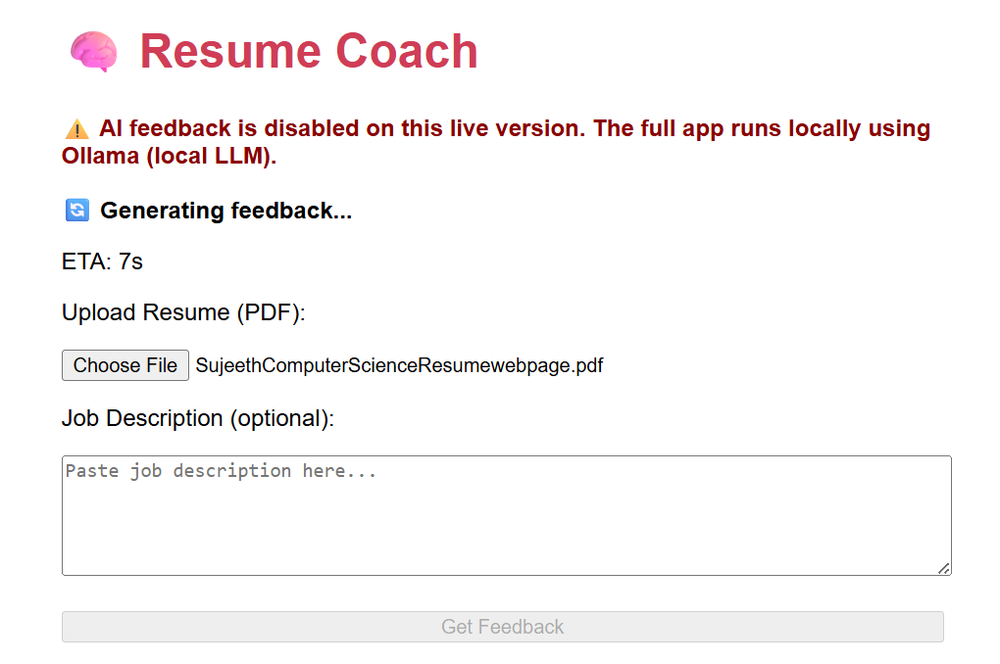
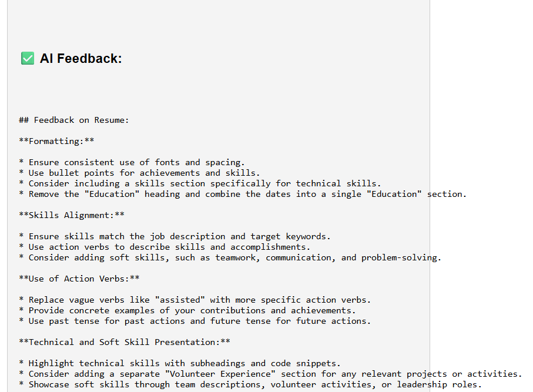
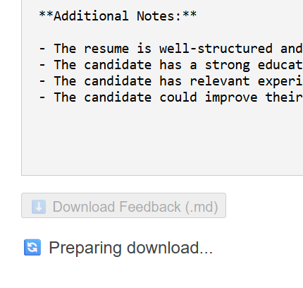

# 🧠 Resume Coach Agent

An AI-powered resume feedback tool built with Flask and Ollama, running entirely offline.

## 🚀 Features

- 📄 Upload your resume (PDF)
- 🧠 Receive detailed AI-generated feedback
- ✍️ Paste a job description to tailor suggestions
- ⏱  ETA countdown
- 💾 Download feedback as a Markdown (.md) file
- ⚡ Smart caching to avoid repeat processing
- 🌐 Live deployed version on Render

## Live Demo

👉 [Visit Live App] (https://resume-coach-agent.onrender.com)

⚠️ Note: Due to Ollama being a local LLM tool, AI feedback is not available in the deployed version.  
To test it fully, clone the repo and run it locally with Ollama installed.

## 🗂 Project Structure
```
resume-coach-agent/
├── backend/
│ ├── app.py # Flask entrypoint
│ ├── routes/ # API endpoints
│ ├── services/ # LLM logic + Markdown export
│ ├── utils/ # PDF parsing + caching
│ └── templates/ # Frontend UI (HTML)
├── requirements.txt
├── render.yaml
└── README.md
```

## Technologies Used
- Python + Flask
- Ollama (gemma:2b model)
- PyMuPDF for PDF parsing
- Jinja2 templating for frontend
- JavaScript for UI loading spinner
- Render for deployment

## ⚙️ Setup Instructions

### Local Setup

``` 
bash
git clone https://github.com/SujeethMuru/resume-coach-agent.git
cd resume-coach-agent
python -m venv venv
venv\Scripts\activate
pip install -r backend/requirements.txt
ollama run gemma:2b   # keep this running
cd backend
python app.py
```
Then visit:
http://localhost:5000/ui

## 🧠 How it Works

1. User uploads a resume + job description

2. Flask sends the input to a locally running LLM via Ollama

3. AI generates feedback which is displayed and cached

4. Feedback is downloadable as .md without reprocessing

## 📜 License

This project is licensed under the MIT License.

## Screenshot (Running Locally with AI feedback)

### 📝 Upload Form


### 🤖 AI Feedback Output


### Download Button


### Made with ❤️ by [Sujeeth](https://github.com/SujeethMuru)

